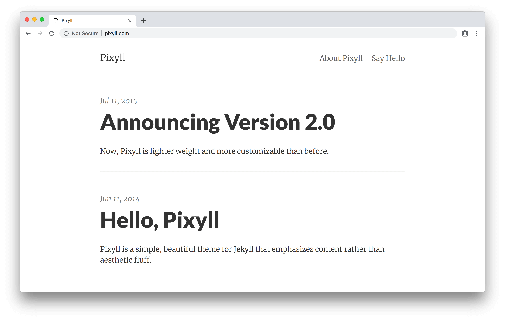

# Github Page website

## Design of this website

This website was created using Jekyll and Pixyll

[pixyll.com](http://www.pixyll.com)

Pixyll is a simple, beautiful theme for Jekyll that emphasizes content rather than aesthetic fluff. It's mobile _first_, fluidly responsive, and delightfully lightweight.

It's pretty minimal, but leverages large type and drastic contrast to make a statement, on all devices.

This Jekyll theme was crafted with <3 by [John Otander](http://johnotander.com)
([@4lpine](https://twitter.com/4lpine)).

中文版 <https://github.com/ee0703/pixyll-zh-cn>.
